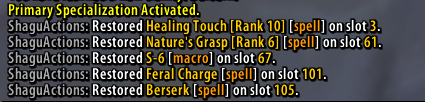

# ShaguActions

*WARNING: The addon works for me, but didn't had much testing yet. It's very possible that you might run into bugs.
I'm not responsible for you losing your actionbar setup or anything else. Use at your own risk.*

This addon saves and restores one actionbar profile for each of the 3 skill trees.
Whenever a respec is detected, it will automatically load the actionset which is saved for that skill tree:

## Installation (Vanilla, 1.12)
1. Download **[Latest Version](https://github.com/shagu/ShaguActions/archive/master.zip)**
2. Unpack the Zip file
3. Rename the folder "ShaguActions-master" to "ShaguActions"
4. Copy "ShaguActions" into Wow-Directory\Interface\AddOns
5. Restart Wow
